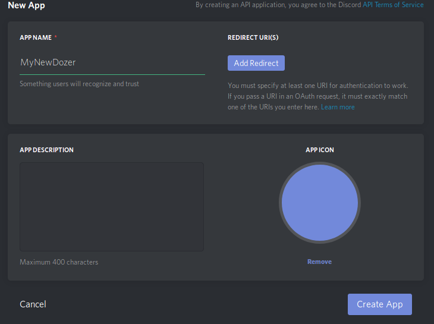
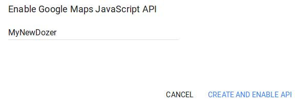

# Dozer
Omnipotent guild management bot for FIRST Discord servers

Table of Contents
=================

   * [Dozer](#dozer)
      * [Setup](#setup)
         * [Installing Python 3.6](#installing-python-36)
            * [Manually](#manually)
            * [Using pyenv](#using-pyenv)
         * [Getting your Discord Bot Token](#getting-your-discord-bot-token)
         * [Getting a Google Maps API Key](#getting-a-google-maps-api-key)
         * [Setting up the bot](#setting-up-the-bot)
         * [Adding the bot to your server](#adding-the-bot-to-your-server)

## Setup

### Installing Python 3.6

run `python -V` to find what version of python you are running. If you are running version 3.6 or newer, feel free to skip this section

 #### Manually

[Unix](https://docs.python.org/3/using/unix.html?highlight=install)

[Windows](https://docs.python.org/3/using/windows.html)

run `python -V` to ensure that version 3.6 or newer is installed. 

#### Using pyenv

Many distributions do not have python 3.6 in their repositories yet. If this is the case for you, then [pyenv](https://github.com/pyenv/pyenv) is a great option for managing different python versions.

Instructions for installing are located [here](https://github.com/pyenv/pyenv-installer).

1. `pyenv install 3.6.3` downloads and builds a newer version of python
2. `pyenv global 3.6.3` sets 3.6.3 as the primary version for the current user
3. run `python -V` to ensure that version 3.6 or newer is installed. 

Through the rest of this README, we will assume that you have found the correct `python` executable for your setup and are using it accordingly.

### Getting your Discord Bot Token

1. Go to the [Discord Developer Portal](https://discordapp.com/developers/applications/me) and create a new application.

    

2. Create a bot user inside of your application. 

   
3. Copy the bot user token - We'll need that later!
   Do not share your token with anyone. If someone obtains your bot user token, they gain full control of your bot. Be careful!

### Getting a Google Maps API Key

1. Go to the [Google Map APIs Docs](https://developers.google.com/maps/documentation/javascript/get-api-key) and request an API key
2. Create a new project. 

   
3. Copy the API key - We'll need this too!

### Setting up the bot

1. Install dependencies with `python -m pip install -Ur requirements.txt`
2. Run the bot once with `python -m dozer`. This will crash, but generate a default config file.
   1. Dozer uses [json](http://www.json.org/) for it's config file
3. Add the Discord bot account's token to `discord_token` in `config.json`
4. Add your Google Maps API key to `gmaps_key` in `config.json`
5. Add information about your team and your bot to `tba` in `config.json`
6. Add your ID, and anyone else's ID who should be able to use the developer commands, to the list `developers` in `config.json`
   1. Be careful giving this out. Developers can control everything your bot does and potentially get your [bot user token!](#Getting-your-discord-bot-token)
7. The default command prefix is &. If this is already in use on your server or you would like another prefix, you can change the `prefix` value in `config.json`.
8. Run the bot again, you should see `Signed in as username#discrim (id)` after a few seconds.

### Adding the bot to your server

Note: This process will eventually be replaced by an `invite` command.

1. To add the bot to your server, paste the following link into your browser.  Your client ID can be found on the applications page in the [Discord Developer Portal](https://discordapp.com/developers/applications/me)

   `https://discordapp.com/oauth2/authorize?client_id=YOUR_CLIENT_ID&scope=bot`

2. Select the server that you would like to add the bot to.

3. Try it out! `[prefix]help` to see what Dozer can do.

   # 
