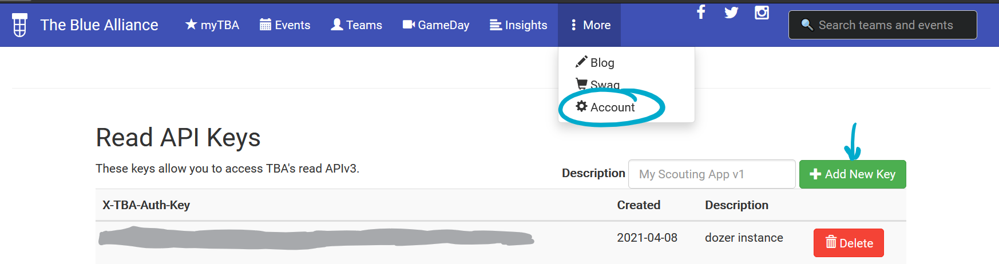

# Instructions on getting API Tokens/Keys

(In progress)

* [Google Maps](#google-maps)
* [The Blue Alliance](#the-blue-alliance)

### Google Maps

1. Go to the [Google Map APIs Docs](https://developers.google.com/maps/documentation/javascript/get-api-key) and request an API key
2. Create a new project. 

   
3. Copy the API key - We'll need this too!

**Currently, getting an API token requires a credit card. If you do not wish to make such a heavy commitment to your bot right now, entering nothing or keeping the default value for your API token will not cause the bot any troubles unless you attempt to call a command that utilizes it.**

4. Paste the API key in config.json, where it says "PUT GOOGLE MAPS API KEY HERE" 

### The Blue Alliance

[Official instructions here](https://www.thebluealliance.com/apidocs)

1. Create a TBA account using your Google Account. Go to https://www.thebluealliance.com, click the myTBA tab, and click the "Log in" button.

2. Go to the "More" tab at the top of the page, select "Account." From there, scroll down to "Read API Keys," enter a description for your bot (I said "dozer instance"), and select "Add New Key."

3. Add the key to config.json, where it says "Put TBA API key here"